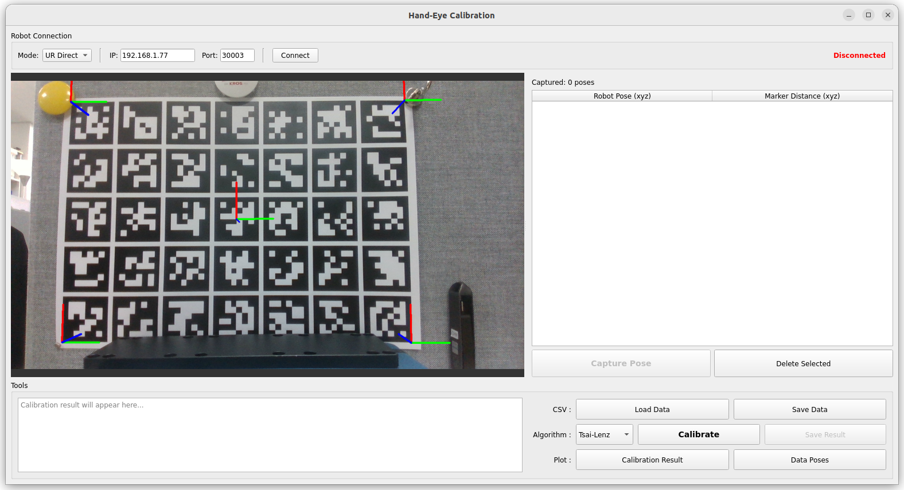
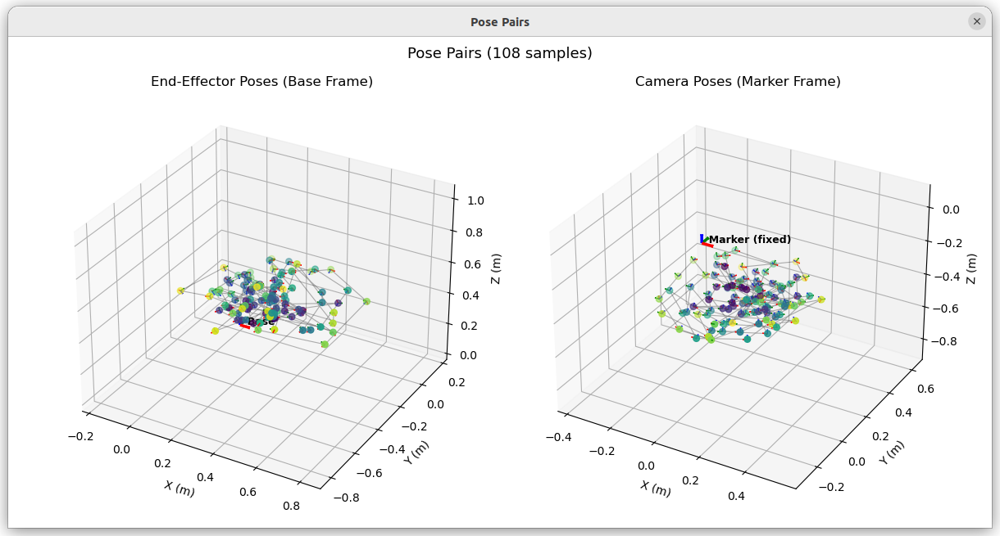
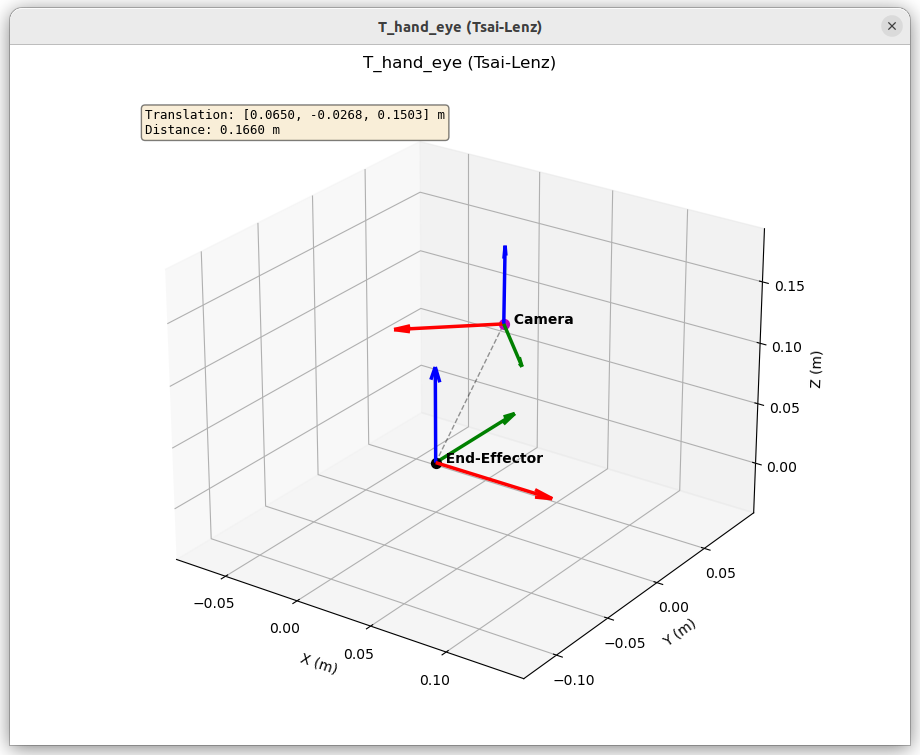

# Hand-Eye Calibration<!-- omit from toc -->

**다중 로봇 지원 Hand-Eye Calibration 시스템 — ROS2 Humble + PyQt5 GUI**

[](https://docs.ros.org/en/humble/)
[](https://www.python.org/)
[](https://isocpp.org/)
[](https://opencv.org/)
[](docker/)
[](LICENSE)

---

## 목차<!-- omit from toc -->

- [데모](#데모)
- [개요](#개요)
  - [프로젝트 목적](#프로젝트-목적)
  - [주요 구성요소](#주요-구성요소)
  - [캘리브레이션 알고리즘](#캘리브레이션-알고리즘)
  - [적용 가능 영역](#적용-가능-영역)
- [주요 기능](#주요-기능)
- [시스템 구조](#시스템-구조)
- [프로젝트 구조](#프로젝트-구조)
- [빠른 시작](#빠른-시작)
  - [Option 1: Docker (권장)](#option-1-docker-권장)
  - [Option 2: Native](#option-2-native)
- [시스템 요구사항](#시스템-요구사항)
  - [필수](#필수)
  - [하드웨어 (지원 로봇)](#하드웨어-지원-로봇)
  - [소프트웨어 의존성](#소프트웨어-의존성)
  - [외부 패키지](#외부-패키지)
- [설치](#설치)
  - [Method 1: Docker (권장)](#method-1-docker-권장)
  - [Method 2: Native](#method-2-native)
- [빌드](#빌드)
  - [전체 빌드](#전체-빌드)
  - [특정 패키지 빌드](#특정-패키지-빌드)
  - [클린 빌드](#클린-빌드)
  - [테스트](#테스트)
- [실행](#실행)
  - [개별 모듈 실행](#개별-모듈-실행)
  - [Docker 실행](#docker-실행)
  - [Docker Commands](#docker-commands)
- [사용법](#사용법)
  - [워크플로우](#워크플로우)
  - [1. 로봇 연결](#1-로봇-연결)
  - [2. 데이터 수집](#2-데이터-수집)
  - [3. 캘리브레이션 실행](#3-캘리브레이션-실행)
  - [4. 결과 확인](#4-결과-확인)
  - [5. 결과 저장](#5-결과-저장)
- [설정](#설정)
  - [Docker 설정](#docker-설정)
  - [DDS (CycloneDDS) 설정](#dds-cyclonedds-설정)
  - [GUI 파라미터](#gui-파라미터)
  - [Doosan 포즈 리더 파라미터](#doosan-포즈-리더-파라미터)
  - [Launch 인자](#launch-인자)
- [API / ROS2 인터페이스](#api--ros2-인터페이스)
- [문제 해결](#문제-해결)
  - [1. Qt 플러그인 충돌](#1-qt-플러그인-충돌)
  - [2. RealSense 카메라 인식 안 됨](#2-realsense-카메라-인식-안-됨)
  - [3. ArUco 마커 검출 안 됨](#3-aruco-마커-검출-안-됨)
  - [4. 캘리브레이션 결과가 부정확함](#4-캘리브레이션-결과가-부정확함)
  - [5. cv_bridge NumPy 버전 충돌](#5-cv_bridge-numpy-버전-충돌)
  - [6. Docker에서 GUI 표시 안 됨](#6-docker에서-gui-표시-안-됨)
  - [7. Orbbec 카메라 NVRAM 타임아웃](#7-orbbec-카메라-nvram-타임아웃)
  - [8. 대용량 센서 메시지 drop](#8-대용량-센서-메시지-drop)
- [라이선스](#라이선스)
- [Maintainer](#maintainer)

---

## 데모

<details>
<summary>GUI 화면</summary>



</details>

<details>
<summary>Pose Pairs 시각화</summary>



</details>

<details>
<summary>캘리브레이션 결과 시각화</summary>



</details>

---

## 개요

### 프로젝트 목적

로봇 엔드이펙터와 카메라 사이의 변환 관계를 구하는 Hand-Eye Calibration 시스템. ROS2 Humble 기반 PyQt5 GUI에서 데이터 수집, 캘리브레이션 실행, 결과 저장까지 한 화면에서 처리하며, read-only 연결로 로봇 제어권을 가져오지 않아 펜던트 조작을 유지한 채 포즈 수집이 가능한 구조.

### 주요 구성요소

- **gui_node** (Python): ROS2 노드 + PyQt5 GUI, 카메라 영상 표시, 포즈 수집, 캘리브레이션 실행
- **calibration** (Python): ArUco 마커 검출, AX=YB / DQ RANSAC / Tsai-Lenz 솔버, 3D 시각화, CSV 입출력
- **robot_interface** (Python): UR Direct (read-only 소켓) 또는 ROS2 TF를 통한 로봇 포즈 획득
- **dsr_pose_reader** (C++): Doosan 로봇 전용 포즈 리더, DRFL 모니터링으로 펜던트 제어 유지
- **카메라 드라이버**: 사용 센서에 따라 선택 (RealSense: `realsense2_camera` apt 설치, Orbbec: `OrbbecSDK_ROS2` VCS 소스 빌드)

### 캘리브레이션 알고리즘

**AX=YB**

- **출처**: Ha, "Probabilistic Framework for Hand-Eye and Robot-World Calibration AX=YB", IEEE T-RO 2023
- **방식**: 절대 포즈를 상대운동으로 합성하지 않고 그대로 사용하며, 카메라 측정의 노이즈가 보드(target) 쪽에 놓이는 배치를 유지한 채 최대우도추정으로 풀이. 닫힌형 초기해(Shah) 후 Levenberg-Marquardt로 정제
- **장점**: 핸드아이 변환과 함께 base→board 변환도 산출해 교차 검증이 가능하며, 잔차 통계(회전 °/병진 mm)를 함께 보고
- **정확도**: 합성 데이터(20 포즈 × 50회, 보드 노이즈 1°/3mm)에서 회전 0.130°, 병진 1.60mm

**DQ RANSAC**

- **출처**: Daniilidis, "Hand-Eye Calibration Using Dual Quaternions", IEEE 1999
- **라이브러리**: [ethz-asl/hand_eye_calibration](https://github.com/ethz-asl/hand_eye_calibration)
- **방식**: 회전과 이동을 Dual Quaternion으로 동시에 풀이하며 RANSAC으로 이상치를 자동 제거
- **장점**: 마커 오검출 등 불량 샘플이 섞인 데이터에 강건하고 인라이어 수를 함께 보고
- **정확도**: 동일 조건에서 회전 0.555°, 병진 5.26mm

**Tsai-Lenz**

- **출처**: Tsai & Lenz, IEEE 1989
- **방식**: 회전(R)을 SVD로 먼저 풀고 이동(t)을 최소자승법으로 풀이
- **장점**: 매우 빠르고 간단하나 이상치 처리가 없어 깨끗한 데이터가 전제
- **정확도**: 동일 조건에서 회전 0.471°, 병진 4.62mm

**4-DOF Calibrator (향후)**

- **출처**: [QuantuMope/handeye-4dof](https://github.com/QuantuMope/handeye-4dof)
- SCARA 등 4축 로봇용으로 현재 라이브러리만 포함 (GUI 통합 예정)

### 적용 가능 영역

- Eye-in-hand 로봇 캘리브레이션 (카메라가 엔드이펙터에 부착된 경우)
- 산업 자동화 시스템의 로봇-카메라 정밀 정합
- 다중 로봇 환경 (UR, Doosan 등)
- 연구 개발 및 교육

---

## 주요 기능

**다중 로봇 지원**: UR Direct (read-only 소켓), Doosan DRFL (모니터링), ROS2 TF 세 가지 방식으로 펜던트 제어를 유지하며 포즈 획득

**3가지 캘리브레이션 알고리즘**: AX=YB (최고 정확도), DQ RANSAC (이상치에 강건), Tsai-Lenz (빠른 결과 확인)

**포즈 데이터 신선도 검증**: 포즈 스트림이 멈추면 같은 값이 반복되어 정지 상태로 오인되므로, 수신 카운터가 실제로 증가했는지 확인한 뒤에만 캡처를 허용. 낡은 로봇 포즈가 최신 영상과 짝지어지는 사고를 캡처 시점에 차단

**PyQt5 GUI**: 카메라 영상 실시간 표시, ArUco 마커 오버레이, 포즈 수집/삭제, 캘리브레이션 실행을 한 화면에서 처리

**3D 시각화**: 수집된 포즈 쌍과 캘리브레이션 결과를 Matplotlib 3D 플롯으로 확인

**ROS2 네이티브**: 카메라 영상은 ROS2 토픽으로 수신 (RealSense / Orbbec 등)하며 TF2로 로봇 포즈 획득 가능

**Docker 지원**: 빌드·실행 스크립트와 컨테이너 내부 명령어 함수(`build`, `camera-*`, `gui-*` 등)를 포함한 원클릭 컨테이너 환경

**데이터 저장/로드**: 포즈 데이터를 CSV로 저장하고 나중에 불러와 재캘리브레이션 가능

---

## 시스템 구조

```
┌───────────────────────┐  ┌──────────────────┐  ┌────────────────────────┐
│ Vision Sensor         │  │ UR Robot         │  │ Doosan Robot           │
│ RealSense / Orbbec    │  │                  │  │                        │
└───────────┬───────────┘  └────────┬─────────┘  └───────────┬────────────┘
            │ USB 3.0               │ TCP:30003              │ TCP:12345
            │                       │ (read-only)            │ (DRFL monitoring)
┌───────────┴───────────┐           │          ┌─────────────┴─────────────┐
│ Camera ROS2 Driver    │           │          │ dsr_pose_reader (C++)     │
│ - Color streaming     │           │          │ - Monitoring only         │
│ - Camera info pub     │           │          │ - Pendant preserved       │
└───────────┬───────────┘           │          └─────────────┬─────────────┘
            │                       │                        │
            │ /camera/color/        │                        │ /tf, /tcp_pose
            │   image_raw           │                        │
            │   camera_info         │                        │
            │                       │                        │
┌───────────┴───────────────────────┴────────────────────────┴────────────┐
│ hand_eye_calibration (gui_node)                                         │
│                                                                         │
│  ┌──────────────┐  ┌──────────────────────────────────────────┐         │
│  │ ArUco        │  │ Robot Interface                          │         │
│  │ Detector     │  │ - UR Direct (read-only socket)           │         │
│  │              │  │ - ROS2 TF (dsr_pose_reader, etc.)        │         │
│  └──────┬───────┘  └────────────────────┬─────────────────────┘         │
│         │                               │                               │
│  ┌──────┴───────────────────────────────┴──────┐                        │
│  │ Capture Pose (freshness-checked)            │                        │
│  │ store marker T + robot T                    │                        │
│  └──────────────────────┬──────────────────────┘                        │
│                         │                                               │
│  ┌──────────────────────┴──────────────────────┐                        │
│  │ Calibration Solver                          │                        │
│  │ - AX=YB   - DQ RANSAC   - Tsai-Lenz         │                        │
│  └──────────────────────┬──────────────────────┘                        │
│                         │                                               │
│  Result: hand-eye (4x4) [+ base->board for AX=YB]                       │
└─────────────────────────────────────────────────────────────────────────┘
```

**데이터 흐름**

[영상] Camera driver → `image_raw`/`camera_info` 토픽 → ArUco Detector → 마커 포즈  
[로봇 포즈] UR 소켓(30003) 또는 dsr_pose_reader → `/tf` → Robot Interface → 로봇 포즈  
[캘리브레이션] 포즈 쌍 (15~30개) → AX=YB / DQ RANSAC / Tsai-Lenz → 4x4 변환 → `data/` 저장

---

## 프로젝트 구조

```
Hand-eye_calibration/                           # ROS2 워크스페이스 루트
├── .github/workflows/release.yml               # 태그 push 시 GitHub Release 자동 생성
├── board_6x6_259.pdf                           # ArUco 그리드 보드 인쇄용 PDF
├── camera_realsense.repos                      # VCS: realsense-ros v4.55.1
├── camera_orbbec.repos                         # VCS: OrbbecSDK_ROS2 v2-main
├── data/                                       # 포즈 CSV, 캘리브레이션 결과 (git 미추적)
├── docs/                                       # GUI, 시각화 캡처 이미지
│
├── docker/
│   ├── Dockerfile                              # CUDA + ROS2 Humble + 의존성
│   ├── config.sh.example                       # 사용자 설정 템플릿 (config.sh로 복사)
│   ├── build.sh                                # Docker 이미지 빌드
│   ├── run.sh                                  # 컨테이너 실행 (기존 컨테이너 재사용/attach)
│   ├── entrypoint.sh                           # 소유권 복원 + RMW(CycloneDDS) 설정
│   ├── cyclonedds.xml                          # CycloneDDS 튜닝 (대용량 센서 메시지)
│   └── commands.sh                             # 컨테이너 명령어 (build, debug-*, camera-*, gui-*, doosan)
│
└── src/
    ├── (camera driver)                         # VCS로 가져옴: realsense-ros 또는 OrbbecSDK_ROS2
    │
    ├── dsr_pose_reader/                        # Doosan 로봇 포즈 리더 (C++)
    │   ├── doosan_api/                         # DRFL 라이브러리 (Doosan Robotics, BSD)
    │   ├── config/default.yaml                 # Doosan 연결 파라미터
    │   ├── launch/dsr_pose_reader.launch.py    # 실행 launch
    │   └── src/pose_reader_node.cpp            # DRFL 모니터링 → PoseStamped/TF 퍼블리시
    │
    └── hand_eye_calibration/                   # 캘리브레이션 패키지 (Python)
        ├── config/default.yaml                 # ROS2 파라미터 (토픽, 마커, 로봇 모드)
        ├── test/
        │   ├── test_calibration.py             # 세 솔버 검증 (합성 데이터)
        │   └── test_pose_readers.py            # 포즈 신선도 회귀 테스트
        └── hand_eye_calibration/
            ├── gui_node.py                     # 메인 ROS2 노드 + PyQt5 GUI
            ├── calibration/                    # ArUco 검출, 솔버, 시각화, CSV 입출력
            │   ├── ax_yb.py                    # AX=YB 솔버 (Ha 2023)
            │   ├── dual_quaternion_ransac.py   # DQ RANSAC 래퍼
            │   └── tsai_lenz.py                # Tsai-Lenz 솔버
            ├── robot_interface/                # UR Direct 소켓 / ROS2 TF 포즈 리더
            ├── hand_eye_calibration_lib/       # ethz-asl DQ RANSAC 라이브러리 (추출)
            └── handeye_4dof_lib/               # 4-DOF 솔버 (추출, GUI 통합 예정)
```

---

## 빠른 시작

### Option 1: Docker (권장)

```bash
# 1. 저장소 클론
git clone https://github.com/hhanoo/hand-eye_calibration.git
cd hand-eye_calibration

# 2. Docker 이미지 가져오기
docker pull hhanoo/project:hand-eye-calibration-humble

# 3. (Orbbec 사용 시, 최초 1회) 드라이버 소스 가져오기 + 호스트 udev rules 설치
vcs import src < camera_orbbec.repos
sudo bash src/OrbbecSDK_ROS2/orbbec_camera/scripts/install_udev_rules.sh
sudo udevadm control --reload-rules && sudo udevadm trigger
#    이후 카메라 USB를 뽑았다 다시 연결

# 4. 컨테이너 실행 (X11 포워딩 포함)
cd docker && ./run.sh

# 5. 빌드 (컨테이너 내부) — build 함수가 Release 빌드 + source를 함께 실행
build

# 6. 카메라와 GUI를 별도 셸에서 실행 (추가 셸은 ./run.sh 재실행으로 attach)
camera-realsense          # 또는 camera-orbbec
gui-realsense             # 또는 gui-orbbec
```

> 센서별 launch 옵션·토픽은 [실행 > 개별 모듈 실행](#개별-모듈-실행) 참고.

### Option 2: Native

사용 센서의 드라이버를 먼저 설치 — [설치 > Method 2](#method-2-native) 참고.

```bash
# 1. 저장소 클론
git clone https://github.com/hhanoo/hand-eye_calibration.git
cd hand-eye_calibration

# 2. 의존성 설치 및 빌드
rosdep install --from-paths src --ignore-src -r -y
colcon build --symlink-install \
  --event-handlers console_direct+ \
  --cmake-args -DCMAKE_BUILD_TYPE=Release
source install/setup.bash

# 3. 카메라와 GUI를 각각 실행
ros2 launch realsense2_camera rs_launch.py    # 터미널 1 (센서별 명령은 아래 참고)
ros2 run hand_eye_calibration gui_node        # 터미널 2
```

- `-DCMAKE_BUILD_TYPE=Release`: 전체 패키지를 `-O3 -DNDEBUG`로 최적화 빌드 (카메라 드라이버 실시간성 확보에 필수)
- `--event-handlers console_direct+`: 빌드 로그를 실시간 스트림으로 출력

---

## 시스템 요구사항

### 필수

| 항목       | 요구사항                                                                   |
| ---------- | -------------------------------------------------------------------------- |
| **OS**     | Ubuntu 22.04                                                               |
| **ROS2**   | Humble                                                                     |
| **Python** | 3.10                                                                       |
| **Camera** | Intel RealSense D415 / D435, Orbbec Femto Mega/Bolt, Gemini 2 등 (USB 3.0) |

### 하드웨어 (지원 로봇)

| 로봇   | 연결 방식                        | 비고                  |
| ------ | -------------------------------- | --------------------- |
| UR     | TCP 소켓 (포트 30003, read-only) | 펜던트 제어 유지      |
| Doosan | DRFL 모니터링 (dsr_pose_reader)  | 펜던트 제어 유지      |
| 기타   | ROS2 TF 방식                     | TF 퍼블리시 노드 필요 |

### 소프트웨어 의존성

**ROS2 패키지:**

- rclpy, rclcpp, sensor_msgs, geometry_msgs, cv_bridge, tf2_ros
- 카메라 드라이버: `realsense2_camera` (v4.55.1) 또는 `OrbbecSDK_ROS2` (v2-main)

**Python 패키지:**

- numpy (<2.0), scipy, sympy
- opencv-contrib-python-headless 4.10.0.84 (ArUco 모듈 포함)
- PyQt5, matplotlib

**C++ 라이브러리 (vendored):**

- DRFL (Doosan Robotics, BSD)
- Poco (PocoFoundation, PocoNet)

### 외부 패키지

| 패키지               | 출처                                                   | 용도                    |
| -------------------- | ------------------------------------------------------ | ----------------------- |
| hand_eye_calibration | https://github.com/ethz-asl/hand_eye_calibration       | DQ RANSAC 솔버          |
| handeye-4dof         | https://github.com/QuantuMope/handeye-4dof             | 4-DOF 캘리브레이션      |
| realsense-ros        | https://github.com/realsenseai/realsense-ros (v4.55.1) | RealSense ROS2 드라이버 |
| OrbbecSDK_ROS2       | https://github.com/orbbec/OrbbecSDK_ROS2 (v2-main)     | Orbbec ROS2 드라이버    |
| DRFL                 | https://robotlab.doosanrobotics.com/ko/Index           | Doosan 로봇 모니터링    |

---

## 설치

### Method 1: Docker (권장)

```bash
# 1. Docker 이미지 가져오기
docker pull hhanoo/project:hand-eye-calibration-humble

# 2. (Orbbec 사용 시, 최초 1회) 호스트에서 udev rules 설치
#    OrbbecSDK_ROS2는 컨테이너에서 소스 빌드되므로 udev rules는 호스트에서 수동 설치 필요
vcs import src < camera_orbbec.repos
sudo bash src/OrbbecSDK_ROS2/orbbec_camera/scripts/install_udev_rules.sh
sudo udevadm control --reload-rules && sudo udevadm trigger

# 3. 컨테이너 실행
cd docker && ./run.sh
```

<details>
<summary>직접 빌드 (개발자용)</summary>

```bash
# 1. 설정 파일 생성 후 IMAGE_NAME을 로컬 이름으로 변경
cd docker
cp config.sh.example config.sh
# config.sh에서 IMAGE_NAME="hand-eye-calibration-humble" 로 수정

# 2. Docker 이미지 빌드
./build.sh

# 3. 컨테이너 실행
./run.sh
```

</details>

### Method 2: Native

#### 1. 시스템 의존성 (센서 공통)

```bash
sudo apt install -y \
  ros-humble-cv-bridge \
  ros-humble-tf2-ros \
  ros-humble-tf2-geometry-msgs \
  ros-humble-image-transport
```

#### 2. Python 패키지

```bash
pip3 install \
  'numpy>=1.21.0,<2.0' \
  scipy sympy \
  opencv-contrib-python-headless==4.10.0.84 \
  PyQt5 PyQt5-sip matplotlib
```

#### 3. 비전 센서별 추가 설치

**Intel RealSense (D415 / D435 등)**

```bash
sudo apt update && sudo apt install -y ros-humble-realsense2-*

# 실행 확인
ros2 launch realsense2_camera rs_launch.py
```

USB 3.0 연결 필수. 인식 불가 시 [문제 해결 > RealSense 카메라 인식 안 됨](#2-realsense-카메라-인식-안-됨) 참고.

**Orbbec (Femto Mega/Bolt, Gemini 2 / 330 시리즈 등)**

```bash
sudo apt update && sudo apt install -y \
  ros-humble-orbbec-camera \
  ros-humble-orbbec-description

# 장치 인식 확인 & 실행
ros2 run orbbec_camera list_devices_node
ros2 launch orbbec_camera <model>.launch.py
```

udev rules은 apt 패키지에 포함되어 자동 설치. 인식 불가 시 `sudo udevadm control --reload-rules && sudo udevadm trigger` 재실행 또는 장치 재연결.

주요 `<model>` launch 파일 매핑:

| 모델                          | launch 파일                   |
| ----------------------------- | ----------------------------- |
| Femto Mega / Mega I           | `femto_mega.launch.py`        |
| Femto Bolt                    | `femto_bolt.launch.py`        |
| Gemini 2                      | `gemini2.launch.py`           |
| Gemini 2 L                    | `gemini2L.launch.py`          |
| Gemini 330 / 335 / 336 시리즈 | `gemini_330_series.launch.py` |
| Astra 2                       | `astra2.launch.py`            |

> Docker 사용 시 [설정 > Docker 설정](#docker-설정)의 `ORBBEC_MODEL`을 사용 모델로 지정하면 컨테이너 내부에서 `camera-orbbec` 함수로 바로 실행 가능.
>
> 특정 버전 고정이나 최신 소스 빌드가 필요한 경우 `camera_realsense.repos` / `camera_orbbec.repos`를 이용한 `vcs import` + `colcon build` 방식도 사용 가능.

---

## 빌드

### 전체 빌드

```bash
colcon build --symlink-install \
  --event-handlers console_direct+ \
  --cmake-args -DCMAKE_BUILD_TYPE=Release
source install/setup.bash
```

`-DCMAKE_BUILD_TYPE=Release`는 워크스페이스 전체 패키지에 적용되며, `OrbbecSDK_ROS2`는 Release 빌드가 특히 권장됨. Docker의 `build` 함수는 여기에 `-DCMAKE_EXPORT_COMPILE_COMMANDS=ON`을 더해 clangd IntelliSense용 `compile_commands.json`을 함께 생성.

### 특정 패키지 빌드

```bash
colcon build --symlink-install --packages-select hand_eye_calibration
colcon build --symlink-install --packages-select dsr_pose_reader
```

### 클린 빌드

```bash
rm -rf build install log
colcon build --symlink-install \
  --event-handlers console_direct+ \
  --cmake-args -DCMAKE_BUILD_TYPE=Release
source install/setup.bash
```

### 테스트

솔버와 포즈 리더는 하드웨어 없이 합성 데이터로 검증 가능.

```bash
cd src/hand_eye_calibration
python3 -m pytest test/ -v
```

| 파일                                                                       | 검증 대상                                                                    |
| -------------------------------------------------------------------------- | ---------------------------------------------------------------------------- |
| [test_calibration.py](src/hand_eye_calibration/test/test_calibration.py)   | 세 솔버가 참값을 복원하는지, 노이즈 조건에서 서로 일치하는지                 |
| [test_pose_readers.py](src/hand_eye_calibration/test/test_pose_readers.py) | UR 소켓 패킷 재조립, TF 캐시 신선도 — 낡은 포즈가 최신값으로 오인되지 않는지 |

---

## 실행

카메라와 GUI는 항상 별도 터미널로 실행. 사용하는 비전 센서마다 launch 명령이 달라 통합 launch 파일은 제공하지 않으며, 센서에 맞는 드라이버와 GUI를 각각 기동하는 방식.

### 개별 모듈 실행

**카메라: Intel RealSense (D415 / D435 등)**

```bash
ros2 launch realsense2_camera rs_launch.py \
  rgb_camera.color_profile:=1280x720x30 \
  depth_module.depth_profile:=1280x720x30 \
  align_depth.enable:=true
```

- 토픽: `/camera/camera/color/image_raw`, `/camera/camera/color/camera_info`
- Docker: `camera-realsense` 함수로 동일 명령 실행

**카메라: Orbbec (Femto Mega/Bolt, Gemini 2 / 330 시리즈 등)**

```bash
ros2 run orbbec_camera list_devices_node                # 장치 인식 확인
ros2 launch orbbec_camera <model>.launch.py \
  color_width:=1280 color_height:=720 color_fps:=30
```

- `<model>`: `femto_mega`, `femto_bolt`, `gemini2`, `gemini2L`, `gemini_330_series`, `astra2` 등
- Docker: `camera-orbbec` 함수 사용 (모델·해상도는 [config.sh](docker/config.sh.example)의 `ORBBEC_MODEL`, `ORBBEC_COLOR_*`로 지정)
- 토픽 prefix가 RealSense(`/camera/camera/color/...`)와 다르게 `/camera/color/...`로 퍼블리시되며, Docker 함수 `gui-orbbec`이 해당 토픽을 자동 오버라이드하여 구독

**GUI 단독 실행**

```bash
# RealSense (config/default.yaml의 토픽 그대로 사용)
ros2 run hand_eye_calibration gui_node

# Orbbec (토픽 prefix가 다르므로 파라미터 오버라이드)
ros2 run hand_eye_calibration gui_node --ros-args \
  -p image_topic:=/camera/color/image_raw \
  -p camera_info_topic:=/camera/color/camera_info
```

**UR 로봇 (UR Direct 모드)**

GUI에서 UR Direct 모드로 직접 연결하므로 별도 드라이버가 불필요.

**Doosan 로봇 (dsr_pose_reader + ROS2 TF 모드)**

dsr_pose_reader를 먼저 실행하고 GUI에서 ROS2 TF 모드로 연결.

```bash
# 터미널 1: Doosan 포즈 리더
ros2 launch dsr_pose_reader dsr_pose_reader.launch.py

# 커스텀 yaml 지정
ros2 launch dsr_pose_reader dsr_pose_reader.launch.py config_file:=/path/to/custom.yaml

# 터미널 2/3: 카메라 + GUI (위 "카메라" 항목 참고)
```

### Docker 실행

> **권장**: 직접 `docker exec`로 컨테이너에 진입하지 말고 항상 [run.sh](docker/run.sh)를 사용할 것.  
> `run.sh`가 이미지 확인, X11 권한, 마운트, 호스트 권한 복원(`HOST_UID`/`HOST_GID`), 기존 컨테이너 재사용을 한 번에 처리.

```bash
cd docker
./run.sh

# 컨테이너 내부 — build 함수가 Release 빌드 + source를 함께 실행
build

# 카메라와 GUI를 별도 셸에서 실행 (추가 셸은 ./run.sh 재실행으로 attach)
camera-realsense   # 또는 camera-orbbec
gui-realsense      # 또는 gui-orbbec
```

### Docker Commands

전체 command 정의는 [commands.sh](docker/commands.sh)를 참고하세요.

| Command            | 설명                         | 참고                                                                              |
| ------------------ | ---------------------------- | --------------------------------------------------------------------------------- |
| `build`            | 워크스페이스 빌드            | Release 빌드 + `install/setup.bash` 적용 (`compile_commands.json` 생성)           |
| `build-debug`      | 디버그 심볼 포함 빌드        | RelWithDebInfo (최적화 유지 + 디버그 심볼)                                        |
| `debug-doosan`     | pose_reader_node 디버그 실행 | gdbserver `:3000` 대기 → 호스트 VSCode에서 F5 attach                              |
| `camera-realsense` | RealSense 카메라 실행        | —                                                                                 |
| `camera-orbbec`    | Orbbec 카메라 실행           | `config.sh`의 `ORBBEC_MODEL` (모델), `ORBBEC_COLOR_WIDTH/HEIGHT/FPS` (해상도)     |
| `gui-realsense`    | GUI 실행 (RealSense 토픽)    | [gui_node.py](src/hand_eye_calibration/hand_eye_calibration/gui_node.py)          |
| `gui-orbbec`       | GUI 실행 (Orbbec 토픽)       | `image_topic` / `camera_info_topic` 파라미터를 `/camera/color/...`로 오버라이드   |
| `doosan`           | Doosan 포즈 리더 실행        | [dsr_pose_reader.launch.py](src/dsr_pose_reader/launch/dsr_pose_reader.launch.py) |
| `source-config`    | `docker/config.sh` 재로드    | —                                                                                 |
| `cmd-help`         | 사용 가능한 명령어 목록 출력 | 컨테이너 접속 시 자동 출력                                                        |

---

## 사용법

### 워크플로우

```
로봇 연결 ───▶ 마커 확인 ───▶ 포즈 수집 (15~30) ───▶ 캘리브레이션 ───▶ 결과 확인/저장
    │           │                │                  │               │
 Connect    영상 오버레이      Capture Pose        Calibrate    Save Result/Data
```

### 1. 로봇 연결

GUI 상단에서:

- **로봇 모드** 선택: `UR Direct` 또는 `ROS2 TF`
- UR Direct: IP/Port 입력 → **Connect** (read-only 소켓, 펜던트 제어 유지)
- ROS2 TF: Base Frame / EE Frame 입력 → **Connect** (dsr_pose_reader 등 TF 퍼블리시 노드 필요)

### 2. 데이터 수집

1. 카메라 영상에 ArUco 마커가 보이는지 확인 (초록색 축이 그려짐)
2. 로봇을 **펜던트로 다양한 자세로 이동**
3. **Capture Pose** 클릭 → 로봇 포즈 + 마커 포즈가 저장됨
4. 15~30개 포즈를 다양한 각도로 수집
5. 잘못된 데이터는 선택 후 **Delete Selected**

> 로봇이 완전히 정지하고 포즈 데이터가 갱신 중일 때만 캡처가 허용되며, 조건을 만족하지 않으면 테두리가 붉게 깜박이고 캡처가 거부됨.

### 3. 캘리브레이션 실행

1. 알고리즘 선택: **AX=YB** (최고 정확도), **DQ RANSAC** (이상치에 강건), **Tsai-Lenz** (빠른 확인)
2. **Calibrate** 클릭
3. 결과: 4x4 변환 행렬 + 품질 지표 (AX=YB는 잔차 RMSE와 base→board 행렬, DQ RANSAC은 RMSE와 인라이어 수)

### 4. 결과 확인

- **Calibration Result**: 캘리브레이션 결과를 3D 좌표계로 시각화
- **Data Poses**: 수집된 포즈 쌍을 3D 플롯으로 확인

### 5. 결과 저장

- **Save Result**: 캘리브레이션 결과를 `data/calibration_result_*.txt`에 저장
- **Save Data**: 포즈 데이터를 `data/pose_pairs.csv`에 저장
- **Load Data**: 이전에 저장한 CSV 데이터를 불러와 재캘리브레이션 가능

---

## 설정

### Docker 설정

**[docker/config.sh.example](docker/config.sh.example)** (`config.sh`로 복사해 사용, git 미추적)

```bash
IMAGE_NAME="hhanoo/project:hand-eye-calibration-humble"  # Docker Hub 이미지 (기본값)
CONTAINER_NAME="hand-eye-calibration-humble"             # Docker 컨테이너 이름
ROS_DOMAIN_ID=98                                         # ROS2 domain
XAUTHORITY_PATH="$HOME/.Xauthority"                      # 호스트의 .Xauthority (Qt GUI / RViz 표시용)
ORBBEC_MODEL="femto_bolt"                                # camera-orbbec 함수가 실행할 Orbbec 모델
ORBBEC_COLOR_WIDTH=1280                                  # Orbbec color 스트림 너비
ORBBEC_COLOR_HEIGHT=720                                  # Orbbec color 스트림 높이
ORBBEC_COLOR_FPS=30                                      # Orbbec color 스트림 FPS
```

> `run.sh` 실행 전 `docker pull hhanoo/project:hand-eye-calibration-humble`로 이미지를 가져올 것.  
> 직접 빌드하려면 `IMAGE_NAME`을 `"hand-eye-calibration-humble"` 등으로 변경 후 `./build.sh` 실행.

### DDS (CycloneDDS) 설정

RealSense / Orbbec의 HD 프레임은 기본 Fast DDS에서 `"Sequence Size Exceeds remaining buffer"` 오류로 drop되는 경우가 있어, Docker 환경은 **CycloneDDS**를 기본 RMW로 사용.

- **[entrypoint.sh](docker/entrypoint.sh)**: 컨테이너 진입 시 `RMW_IMPLEMENTATION=rmw_cyclonedds_cpp`, `CYCLONEDDS_URI=file:///etc/cyclonedds.xml` export
- **[cyclonedds.xml](docker/cyclonedds.xml)**: RTPS 레벨에서 대용량 메시지 처리를 안정화하는 튜닝 값
  - `MaxMessageSize=65500B` — IP 레벨 fragmentation 대신 Cyclone이 직접 분할
  - `SocketReceiveBufferSize min="10MB"` — HD 프레임 burst 버퍼링
- **[run.sh](docker/run.sh)**: 위 버퍼 값이 실제로 적용되도록 호스트 커널 sysctl 튜닝 수행 (`sudo` 필요)
  - `net.core.rmem_max / wmem_max = 64MB`
  - `net.ipv4.ipfrag_time=3`, `ipfrag_high_thresh=128MB`

> Native 환경에서도 대용량 센서 메시지를 다룰 때는 동일한 RMW / sysctl 튜닝을 권장.  
> `sudo apt install ros-humble-rmw-cyclonedds-cpp` 후 위 환경변수를 export 하면 충분.

### GUI 파라미터

**[src/hand_eye_calibration/config/default.yaml](src/hand_eye_calibration/config/default.yaml)**

```yaml
hand_eye_calibration:
  ros__parameters:
    # 카메라 토픽
    image_topic: "/camera/camera/color/image_raw"
    camera_info_topic: "/camera/camera/color/camera_info"

    # ArUco 마커 설정
    marker_dict: 10 # cv2.aruco.DICT_6X6_250
    board_grid_shape: [5, 7] # 그리드 보드 (cols, rows)
    marker_length: 0.037 # 마커 크기 (m)
    marker_separation: 0.003 # 마커 간격 (m)

    # 로봇 설정
    robot_mode: "ur_direct" # "ur_direct" 또는 "ros2_tf"

    # ROS2 TF 설정
    tf_base_frame: "base_link"
    tf_ee_frame: "tool0"

    # 데이터 저장 경로
    data_dir: "data/"
```

주요 파라미터:

| 파라미터            | 타입   | 기본값      | 설명                                                  |
| ------------------- | ------ | ----------- | ----------------------------------------------------- |
| `marker_length`     | float  | 0.037       | ArUco 마커 한 변의 실제 크기 (m) — 정확도에 매우 중요 |
| `marker_separation` | float  | 0.003       | 그리드 보드에서 마커 간 간격 (m)                      |
| `board_grid_shape`  | list   | [5, 7]      | 그리드 보드의 (열, 행) 수                             |
| `robot_mode`        | string | "ur_direct" | 로봇 포즈 획득 방식 ("ur_direct" / "ros2_tf")         |

> `marker_length`와 `marker_separation`은 인쇄된 보드를 실측한 값으로 지정할 것. 인쇄 배율에 따라 설계값과 달라지며, 둘의 비율이 어긋나면 보이는 마커 조합마다 다른 보드 자세가 추정되어 캘리브레이션이 흔들림.

### Doosan 포즈 리더 파라미터

**[src/dsr_pose_reader/config/default.yaml](src/dsr_pose_reader/config/default.yaml)**

```yaml
dsr_pose_reader:
  ros__parameters:
    robot_ip: "192.168.137.101" # Doosan 컨트롤러 IP
    robot_port: 12345 # Doosan 컨트롤러 포트
    base_frame: "base_link" # TF base frame
    ee_frame: "tool0" # TF end-effector frame
    publish_rate: 30.0 # Hz
    publish_tf: true # TF 브로드캐스트 활성화
```

### Launch 인자

**dsr_pose_reader.launch.py:**

| 인자          | 기본값                | 설명                    |
| ------------- | --------------------- | ----------------------- |
| `config_file` | `config/default.yaml` | 파라미터 YAML 파일 경로 |

```bash
ros2 launch dsr_pose_reader dsr_pose_reader.launch.py config_file:=/path/to/custom.yaml
```

---

## API / ROS2 인터페이스

**노드**

| 노드                   | 언어   | 패키지               | 설명                          |
| ---------------------- | ------ | -------------------- | ----------------------------- |
| `hand_eye_calibration` | Python | hand_eye_calibration | 캘리브레이션 GUI + ROS2 노드  |
| `dsr_pose_reader`      | C++    | dsr_pose_reader      | Doosan 로봇 TCP 포즈 퍼블리셔 |

**Subscribed 토픽**

| Topic                              | Type                         | 노드                 | 설명                 |
| ---------------------------------- | ---------------------------- | -------------------- | -------------------- |
| `/camera/camera/color/image_raw`   | `sensor_msgs/msg/Image`      | hand_eye_calibration | RGB 카메라 이미지    |
| `/camera/camera/color/camera_info` | `sensor_msgs/msg/CameraInfo` | hand_eye_calibration | 카메라 내부 파라미터 |

**Published 토픽**

| Topic      | Type                            | 노드            | 설명                          |
| ---------- | ------------------------------- | --------------- | ----------------------------- |
| `tcp_pose` | `geometry_msgs/msg/PoseStamped` | dsr_pose_reader | Doosan TCP 포즈 (base 기준)   |
| `/tf`      | `tf2_msgs/msg/TFMessage`        | dsr_pose_reader | base_link → tool0 변환 (옵션) |

**네트워크 구성**

| 대상             | 프로토콜 | 포트  | 방향       | 비고                      |
| ---------------- | -------- | ----- | ---------- | ------------------------- |
| UR 로봇          | TCP      | 30003 | read-only  | 로봇에 명령 전송하지 않음 |
| Doosan 로봇      | TCP      | 12345 | monitoring | DRFL 모니터링 전용        |
| RealSense 카메라 | USB 3.0  | —     | —          | ROS2 토픽으로 수신        |

---

## 문제 해결

### 1. Qt 플러그인 충돌

증상:

```
qt.qpa.plugin: Could not load the Qt platform plugin "xcb"
```

해결:

- Dockerfile에서 `opencv-contrib-python-headless` 사용 (OpenCV 번들 Qt 제거)
- 또는 `gui_node.py` 상단에 `os.environ.pop("QT_QPA_PLATFORM_PLUGIN_PATH", None)` 확인

### 2. RealSense 카메라 인식 안 됨

증상:

```
lsusb | grep Intel  # 결과 없음
```

해결:

```bash
sudo usermod -aG video $USER
sudo usermod -aG plugdev $USER
```

### 3. ArUco 마커 검출 안 됨

해결:

- 조명이 충분한지 확인
- 카메라에서 마커까지 거리: 0.3m ~ 2m 권장
- `marker_length` 값이 실제 마커 크기와 일치하는지 확인

### 4. 캘리브레이션 결과가 부정확함

증상:

```
잔차 RMSE가 회전 수 도, 병진 수십 mm 이상으로 나오거나
DQ RANSAC 인라이어가 전체 샘플의 절반 이하
```

해결:

- 인쇄된 보드를 실측해 `marker_length` / `marker_separation`이 맞는지 확인 — 둘의 비율이 어긋나면 보이는 마커 조합마다 보드 자세가 달라져 회전 오차가 커짐
- 보드까지 거리를 0.3~0.4m로 두고 다양한 각도로 재수집
- 포즈 쌍의 정합성을 직접 확인. 카메라가 손에 고정되어 있으면 두 자세 사이의 **로봇 상대 회전각과 카메라 상대 회전각이 같아야** 하며, 이 값이 1° 이상 어긋나는 쌍은 캘리브레이션 결과와 무관하게 물리적으로 성립하지 않는 데이터

> 이 검사는 캘리브레이션 값을 몰라도 성립하므로, 수집한 CSV의 품질을 사후 판정하는 데 사용 가능.

### 5. cv_bridge NumPy 버전 충돌

증상:

```
AttributeError: module 'numpy' has no attribute 'bool'
```

해결:

```bash
pip3 install 'numpy>=1.21.0,<2.0'
```

### 6. Docker에서 GUI 표시 안 됨

증상:

```
cannot open display: :0
```

해결:

```bash
# 호스트에서 X11 접근 허용
xhost +local:docker

# DISPLAY 환경변수 확인
echo $DISPLAY
```

### 7. Orbbec 카메라 NVRAM 타임아웃

증상:

```
Failed to get NVRAM data, timeout
```

`list_devices_node`는 카메라를 정상적으로 찾지만 launch 직후 약 10초 뒤 타임아웃으로 프로세스가 종료되는 상황.

해결:

1. 호스트에서 OrbbecViewer 등 카메라를 점유 중인 프로세스 종료
2. 컨테이너를 완전히 내림: `docker stop <name> && docker rm <name>`
3. 카메라 USB + 12V 전원 어댑터 모두 뽑고 5초 후 재연결
4. 컨테이너 재실행 후 launch 재시도

> Femto Bolt는 12V 외부 전원 어댑터가 필수 (USB 버스 파워만으로는 부족).

### 8. 대용량 센서 메시지 drop

증상:

```
Sequence Size Exceeds remaining buffer
```

RealSense / Orbbec HD 프레임 구독 시 Fast DDS가 메시지를 drop하거나 위 오류 로그 출력.

해결:

Docker 환경은 [설정 > DDS (CycloneDDS) 설정](#dds-cyclonedds-설정)에 따라 이미 CycloneDDS + sysctl 튜닝이 적용된 상태. Native 환경이거나 `run.sh`를 거치지 않고 컨테이너를 실행한 경우 호스트에서 다음을 수동 적용.

```bash
sudo sysctl -w net.core.rmem_max=67108864
sudo sysctl -w net.core.wmem_max=67108864
sudo sysctl -w net.ipv4.ipfrag_high_thresh=134217728

export RMW_IMPLEMENTATION=rmw_cyclonedds_cpp
export CYCLONEDDS_URI=file:///etc/cyclonedds.xml   # 또는 로컬 경로
```

---

## 라이선스

이 프로젝트는 MIT 라이선스로 배포됩니다. 자세한 내용은 [LICENSE](LICENSE) 파일을 참조하세요.

> `src/dsr_pose_reader/doosan_api/`(DRFL, Doosan Robotics, BSD)와 `hand_eye_calibration_lib/`(ethz-asl), `handeye_4dof_lib/`(QuantuMope) 등 제3자 파생 코드는 각 원저작자의 라이선스를 따릅니다.

---

## Maintainer

**hhanoo** (woo980711@gmail.com)
